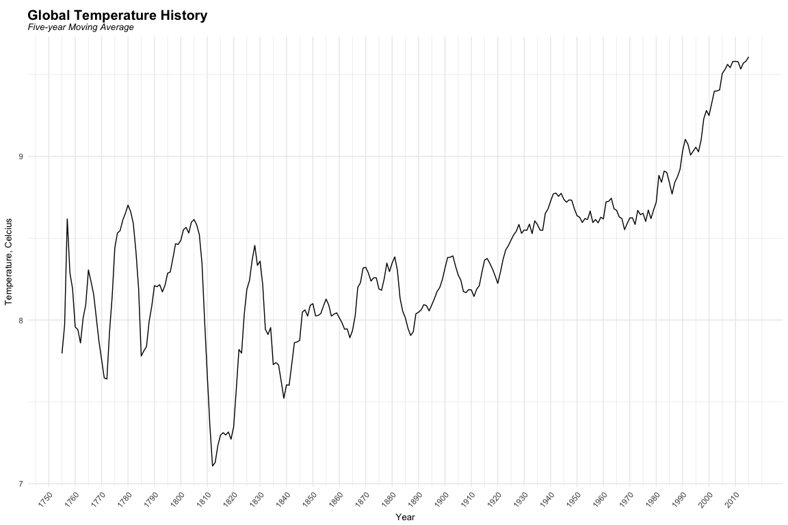
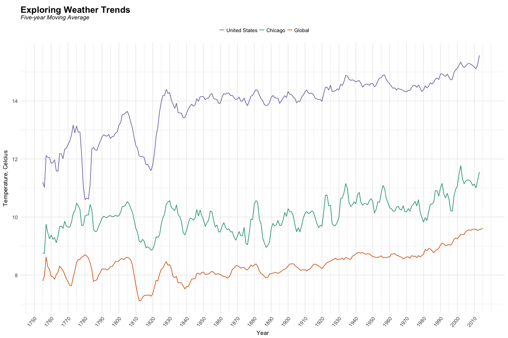
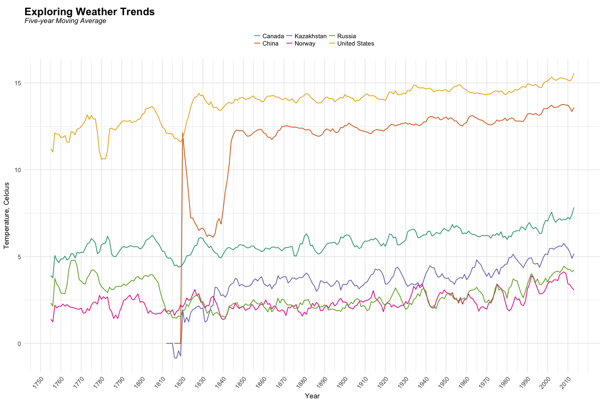

Udacity Project 1: Exploring Weather Trends
================
Josh Goldberg
12/30/2017

#### Load Libraries

``` r
library(tidyverse)
library(knitr)
```

##### [Clone Git Link](https://github.com/GoldbergData/Udacity-Exploring-Weather-Trends.git)

#### Read Data

Used all cities data to have optionality when visualizing trends.

``` r
cities <- read_csv(
  'results-3.csv',
  col_type = cols(
  year = col_integer(),
  city = col_character(),
  country = col_character(),
  avg_temp = col_double()
  )
  )

global <- read_csv(
  'results.csv',
  col_type = cols(
  year = col_integer(),
  avg_temp = col_double()
  )
  )
```

#### Function: Calculate Moving-average

This functions takes a vector of numeric values and an interval designation as its inputs. The vector should include the data for calculating the moving-average. The interval is what period the moving-average should be calculated over. The function will place the calculated averages in the proper index as to allow easy binding of rows afterwards to the original data set (this can be witnessed later when the function is called)

``` r
movavg <- function(x, interval = 5) {
  j <- interval
  moving_avg <- vector(mode = 'double', length = length(x))
  for(i in seq_along(x)) {
    moving_avg[j] <- mean(x[i:interval])
    if (interval >= length(x)) {
      return(moving_avg)
    } else {
      interval <- interval + 1
    }
    j <- j + 1
  }
}
```

#### Transform Data

Here the data is transformed in order to allow easy consolidation for visualization purposes. There is always another way to do something, but I decided to marry country data with city data so I can easily plot afterwards. I point this out because it can be confusing if you're only viewing the code. I also create some fields (view `global` and `result_all_country$city` below) solely for the purpose of data combination.

``` r
global$city <- 'global'
global$country <- 'global'

result_all <- global %>% 
  select(year, city, country, avg_temp) %>% 
  bind_rows(cities) %>% 
  group_by(city) %>% 
  mutate(moving_avg = movavg(avg_temp, interval = 5))

result_all_country <- result_all %>%
  filter(!is.na(avg_temp)) %>% 
  group_by(country, year) %>% 
  summarise(avg_temp = mean(avg_temp, na.rm = TRUE)) %>% 
  mutate(moving_avg = movavg(avg_temp, interval = 5))

result_all_country$city <- result_all_country$country

# Marry U.S. to city data for easy plotting
result_all <- result_all_country %>% 
  select(year, city, country, avg_temp, moving_avg) %>% 
  filter(country == 'United States') %>% 
  bind_rows(result_all)

cold_countries <- filter(result_all, moving_avg < 3, moving_avg > 0) %>% 
  arrange(moving_avg, country) %>% 
  distinct(country)
```

#### Key Visualization Considerations

Most of my considerations were listed above in the latter section, but I will repeat here for clarity, with further detail. I married data from different data sets to allow for easy visualization and comparison. This was a deviation from the original instructions to only pull temperature data for the closet major city to me. I liked the optionality of being able to summarize countries and find extreme temperature patterns affecting the aggregations. For example, The obvious warmth of Chicago compared to the world can be quickly discern by viewing the United States moving average temperatures in the same chart. The U.S. is in a relatively mild geography when it comes to climates. This interpretation of U.S. temperatures can be extrapolated to Chicago for quick understanding of Chicago's relative warmth.

#### Global Historical Moving-average Temperatures

Barring [extraordinary events](https://www.thoughtco.com/the-year-without-a-summer-1773771), global temperatures have been climbing over the past couple hundred years. The chart below could be mistaken for the stock market without aiding details, as occasional dips and a consistent upward trend is commonplace in the equity indexes.

``` r
ggplot(data = filter(
  result_all,
  year > 1754,
  city %in% c('global')
  ),
  aes(year, moving_avg)) +
  geom_line() +
  scale_color_brewer(
  type = 'qual',
  palette = 2
  ) +
  scale_x_continuous(breaks = seq(1750, 2010, 10)) +
  labs(title = 'Global Temperature History', subtitle = 'Five-year Moving Average', x = 'Year', y = 'Temperature, Celcius') +
  theme_minimal() +
  theme(
  axis.text.x = element_text(angle = 50, hjust = 1),
  plot.title = element_text(
  size = 15,
  face = 'bold',
  color = 'black',
  vjust = -1
  ),
  plot.subtitle = element_text(size = 10, face = 'italic',
  color = 'black'),
  axis.title.x = element_text(size = 10, vjust = -0.2),
  axis.title.y = element_text(size = 10),
  legend.position = 'top'
  )
```



#### Chicago, Illinois vs. Global

Despite its putative record-holding for cold temperatures in the U.S., Chicago, Illinois has been warmer over time compared to global moving average temperatures (five-year period) in the past couple hundred years. Note that global temperatures are less volatile than Chicago due to the amount of data consolidated (Chicago is one city, global includes many cities; in other words: [Law of Small Numbers](http://stats.org.uk/statistical-inference/TverskyKahneman1971.pdf).

There are some exceptions in Chicago and global temperature trends:

In 1770, the dip in global temperatures is not as pronounced in Chicago. In 1779, the dip in temperature in Chicago is not visible in global temperatures. In 1995, the severe dip in Chicago temperatures is not pronounced in global temperatures.

There are more trivial differences; however, generally speaking, the plot illustrates tandem trends between Chicago and global temperatures (with Chicago being consistently hotter).

``` r
ggplot(data = filter(
  result_all,
  year > 1754,
  city %in% c('Chicago', 'United States', 'global')
  ),
  aes(year, moving_avg)) +
  geom_line(aes(color = city)) +
  scale_color_brewer(
  type = 'qual',
  palette = 2,
  guide = guide_legend(
  title = NULL,
  keywidth = .75,
  keyheight = .75
  ),
  breaks = c('United States', 'Chicago', 'global'),
  labels = c('United States', 'Chicago', 'Global')
  ) +
  scale_x_continuous(breaks = seq(1750, 2010, 10)) +
  labs(title = 'Exploring Weather Trends', x = 'Year', subtitle = 'Five-year Moving Average', y = 'Temperature, Celcius') +
  theme_minimal() +
  theme(
  axis.text.x = element_text(angle = 50, hjust = 1),
  plot.title = element_text(
  size = 15,
  face = 'bold',
  color = 'black',
  vjust = -1
  ),
  plot.subtitle = element_text(size = 10, face = 'italic',
  color = 'black'),
  axis.title.x = element_text(size = 10, vjust = -0.2),
  axis.title.y = element_text(size = 10),
  legend.position = 'top'
  )
```



#### Cold Countries Weigh Down Global Averages

Chicago's overall warmer temperature can be explained by the fact that its moving average temperatures are not impacted by the extremely cold moving average temperatures included in global calculations. Here are some of the coldest countries included in global temperature calculations:

| country    |
|:-----------|
| Russia     |
| Kazakhstan |
| Norway     |
| China      |
| Canada     |

``` r
ggplot(data = filter(
  result_all_country,
  year > 1754,
  country %in% (cold_countries$country)
  ),
  aes(year, moving_avg)) +
  geom_line(aes(color = country)) +
  scale_color_brewer(
  type = 'qual',
  palette = 2,
  guide = guide_legend(
  title = NULL,
  keywidth = .75,
  keyheight = .75
  )
  ) +
  scale_x_continuous(breaks = seq(1750, 2010, 10)) +
  labs(title = 'Exploring Weather Trends', x = 'Year', subtitle = 'Five-year Moving Average', y = 'Temperature, Celcius') +
  theme_minimal() +
  theme(
  axis.text.x = element_text(angle = 50, hjust = 1),
  plot.title = element_text(
  size = 15,
  face = 'bold',
  color = 'black',
  vjust = -1
  ),
  plot.subtitle = element_text(size = 10, face = 'italic',
  color = 'black'),
  axis.title.x = element_text(size = 10, vjust = -0.2),
  axis.title.y = element_text(size = 10),
  legend.position = 'top'
  )
```


